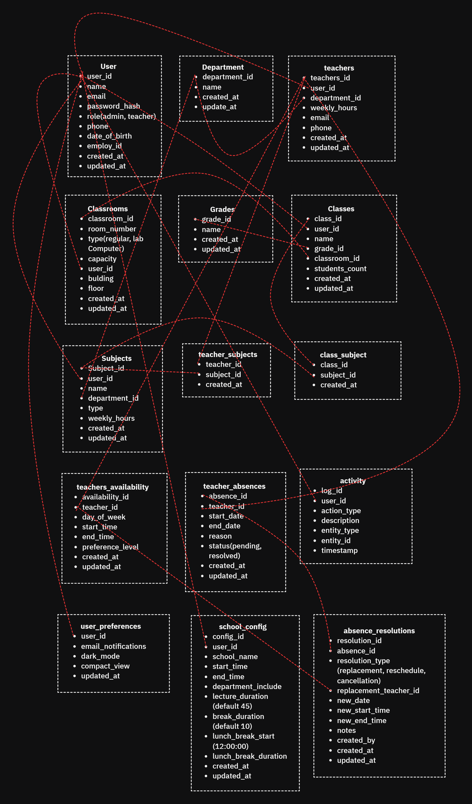

### 1. Define Your Requirements:
Before diving into development, it's essential to map out all your requirements. Based on what you mentioned, here's a summary:
- **Features**: Generate timetable, manage teacher absences, choose time and breaks, multiple teachers and classrooms, no schedule clashes, theory or practical lecture option, variable number of lectures, start and end time, duration of each lecture, Excel view of the timetable.

### 2. Design the Application Architecture:
- **Frontend**: Design an intuitive user interface (UI) where users can input all the necessary data (teachers, classes, lecture timings, etc.). Consider using frameworks like React, Angular, or Vue.js.
- **Backend**: Create a robust backend to handle data processing, generate timetables, and ensure no clashes. Popular backend technologies include Node.js, Django, or Flask.
- **Database**: Choose a suitable database to store all your data. SQL databases like MySQL or PostgreSQL can be a good fit due to their relational nature.

### 3. Implement Key Features:
Here’s a breakdown of how you can approach the implementation of each feature:

#### a. Input Handling:
- Allow users to input details about teachers, classes, time, breaks, etc.
- Validate inputs to ensure data integrity.

#### b. Timetable Generation:
- Develop an algorithm to generate a timetable based on the input data. Ensure that the algorithm handles:
  - No clash of teachers across different classrooms.
  - Optional theory or practical lectures.
  - Variable number of lectures per day.

#### c. Absence Management:
- Create a feature to handle teacher absences and automatically adjust the timetable accordingly.

#### d. Export Timetable:
- Implement an option to export the generated timetable to an Excel file.

### 4. Testing:
- Thoroughly test each feature to ensure the application works as expected. Perform unit tests, integration tests, and user acceptance testing.

### 5. Deployment:
- Deploy your application to a server or cloud platform. Consider using services like AWS, Azure, or Heroku for deployment.

### 6. Iteration & Improvement:
- Gather feedback from users and continuously improve the application by adding new features and fixing any bugs.

### 7. Documentation:
- Document the project thoroughly to make it easier for users and developers to understand how to use and contribute to the project.

### Tools & Technologies:
- **Frontend**: React, Angular, Vue.js
- **Backend**: Node.js, Django, Flask
- **Database**: MySQL, PostgreSQL
- **Others**: Python for algorithm development, pandas library for Excel export.

 
 

Here's a **90-day plan** for your timetable generation application, with an optional **30-day research phase** (total **120 days** if needed). The plan ensures a structured approach covering **research, design, development, testing, and deployment**.

---

## 📌 **Phase 1: Research & Planning (Optional - 30 Days)**
- **Day 1-10**: Research algorithms for timetable generation (constraint satisfaction, graph coloring, genetic algorithms, etc.).
- **Day 11-20**: Study best practices for frontend and backend tech stacks (React vs. Angular, Node.js vs. Django, etc.).
- **Day 21-30**: Prototype simple scheduling logic and test database schema with sample data.

---

## ✅ **Phase 2: Design & Setup (Days 1-15)**
- **Day 1-5**: Define software requirements & create a project roadmap.
- **Day 6-10**: Design the database schema (tables for teachers, subjects, classrooms, schedules, etc.).
- **Day 11-15**: Set up development environment (frontend, backend, database integration).

---

## 🚀 **Phase 3: Core Development (Days 16-60)**
### **Backend Development**
- **Day 16-25**: Implement user authentication (if needed) and database models.
- **Day 26-35**: Develop APIs for input handling (teachers, lectures, classrooms).
- **Day 36-45**: Implement **timetable generation algorithm** and optimize for constraints.
- **Day 46-50**: Add teacher absence management and automatic adjustments.

### **Frontend Development**
- **Day 51-55**: Develop UI for input forms and validation.
- **Day 56-60**: Display timetable visually and allow modifications.

---

## 📊 **Phase 4: Advanced Features (Days 61-75)**
- **Day 61-65**: Implement **Excel export** using pandas.
- **Day 66-70**: Add role-based access control (admins, teachers, students).
- **Day 71-75**: Create an API for third-party integrations (if needed).

---

## 🛠 **Phase 5: Testing & Debugging (Days 76-85)**
- **Day 76-80**: Unit testing (individual functions and components).
- **Day 81-85**: Integration testing (backend, frontend, database).

---

## 🌍 **Phase 6: Deployment & Feedback (Days 86-90)**
- **Day 86-87**: Deploy to AWS, Azure, or Heroku.
- **Day 88-89**: Collect user feedback and document issues.
- **Day 90**: Final improvements and project wrap-up.

---

